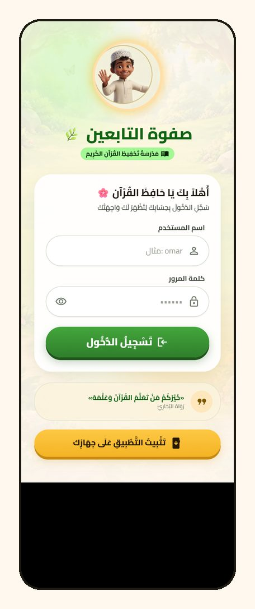

# صفوة التابعين — نسخة الويب


منظومة عربية لمتابعة حفظ القرآن الكريم يوماً بيوم، تربط **الطالب** و**المحفظ** و**المشرف** في تطبيق واحد: خطة فردية لكل طالب، تسجيل التسميع بالصفحة والسُّدس، ألوان توضح من تقدّم ومن تأخر، ومنافسة إيجابية بين الطلاب والصفوف.

هذه النسخة هي **إعادة بناء كاملة بـ Vue 3** لتطبيق Flutter الأصلي، بنفس التصميم والشاشات والحسابات وعلى نفس قاعدة البيانات، لهدف واحد: **السرعة**. تطبيقا أندرويد وآيفون يبقيان على Flutter.

<p align="center"></p>

## لماذا إعادة البناء؟

Flutter على الويب يحمّل محرك رسم كاملاً قبل أن يعرض أي شيء، وهذا ثقيل على إنترنت الجوال. الحل كان تطبيق ويب أصلياً يعرض الشاشة بملفات صغيرة:

| | Flutter على الويب | هذه النسخة |
|---|---|---|
| حجم أول زيارة (شاشة الدخول) | ≈ 2.5 ميغابايت | ≈ 90 كيلوبايت JS + 46 كيلوبايت خطوط |
| ظهور شاشة الدخول على 4G سريع | عدة ثوانٍ | ≈ 1.4 ثانية |
| الزيارات التالية | تحميل من جديد | أقل من 0.1 ثانية |
| بلا إنترنت | لا يعمل | يفتح (بعد أول زيارة) |

## الشاشات

### الطالب
الرئيسية (الترتيب، الوِرد اليومي، كأس الحفظ)، رحلة الحافظ عبر الأجزاء الثلاثين، وإنجازاتي بتقويم الالتزام وسجل الأيام.


### المحفظ
إنجاز الصف اليوم، قائمة الطلاب بحالاتهم اللونية، تسجيل الإنجاز باختيار الصفحات والتقييم، وملف الطالب مع الخطة.


### المشرف
لوحة المشروع، ترتيب الصفوف، إدارة الحسابات، وتقارير الحفظ والإتقان.


> كل الأسماء والبيانات في اللقطات وفي مجلد `reference/logic` **وهمية**؛ استُبدلت بالأسماء الحقيقية حفاظاً على خصوصية الطلاب.

## المزايا

| الدور | ما يقدّمه |
|---|---|
| **الطالب** | وِرد يومي محسوب تلقائياً، كأس الحفظ ونسبة التقدم، مسار الأجزاء، ترتيبه بين الطلاب، تقويم شهري للالتزام |
| **المحفظ** | مؤشر إنجاز صفه، تسجيل التسميع (صفحة كاملة أو ⅓ أو ½ أو ⅔) مع تقييم وملاحظة، تسجيل يوم سابق، تعديل خطة الطالب، بحث وتصفية بالحالة |
| **المشرف** | لوحة المشروع، إدارة الصفوف والمحفظين، إنشاء حسابات الطلاب والمحفظين وتعديلها وحذفها، تقارير أسبوعية وشهرية، إعدادات المشروع وأيام الإجازة |
| **للجميع** | واجهة عربية RTL مشكولة، تثبيت كتطبيق على الشاشة الرئيسية، عمل بلا إنترنت، سحب للتحديث |

**منطق الخطة:** الصفحات المتبقية من المصحف (604 صفحة) تُوزَّع على 170 يوماً من تاريخ البداية بعد استثناء أيام الإجازة، فيظهر لكل طالب وِرده اليومي. الحالة اللونية: أخضر (على المسار)، أصفر (يحتاج متابعة)، أحمر (متأخر بثلاثة أيام أو أكثر).

## التقنيات

| الطبقة | التقنية |
|---|---|
| الواجهة | Vue 3 (`<script setup>`) + TypeScript |
| الأدوات | Vite 8، `vue-tsc`، Vitest |
| التوجيه | vue-router مع حارس صلاحيات حسب الدور |
| الخلفية | Supabase: Postgres، Auth، دوال RPC لحساب المؤشرات، Edge Function لإدارة الحسابات |
| الاتصال | `@supabase/auth-js` + `@supabase/postgrest-js` بدل الحزمة الكاملة (توفير ≈ 30KB) |
| الخطوط | Cairo مقتطعة بالعربية والأرقام (≈ 22KB للوزن)، وAmiri للآية فقط |
| الأيقونات | 85 أيقونة SVG مستخرجة من ملف Material Symbols نفسه الذي يستعمله Flutter |
| العمل بلا إنترنت | Service Worker يولّده Vite plugin مخصص (≈ 1KB، بلا Workbox) |
| النشر | Netlify (موقع ثابت + إعادة توجيه SPA) |

### المعمارية

```
المتصفح (Vue SPA + Service Worker)
   │  PostgREST / RPC            ┌─ student_metrics   leaderboard   halaqa_metrics
   ├────────────────────────────►│  daily_series      juz_progress  project_totals
   │                             └─ Postgres + RLS
   │  Auth (اسم مستخدم → username@tabeen.app)
   └──────────────► Supabase Auth
   │  Edge Function manage-users (إنشاء/تعديل/حذف الحسابات بصلاحية المشرف)
```

الحسابات باسم مستخدم وكلمة مرور (يُحوَّل الاسم داخلياً إلى بريد وهمي)، والمشرف وحده ينشئ الحسابات عبر الـ Edge Function. الجداول والدوال والـ Edge Function في مشروع Flutter المرافق (`supabase/`)، وهذا المستودع يستهلكها فقط.

## قرارات تقنية تستحق الذكر

- **مطابقة Flutter رقماً بعد رقم:** منطق الحسابات (الحالة اللونية، الورد، التواريخ، الأجزاء) مُنقَل من Dart إلى TypeScript، ويُختبر بـ **93 اختباراً مرجعياً (golden)** قيمُها ناتجة عن تشغيل كود Flutter نفسه على نفس البيانات (`reference/logic/dart_ref`).
- **تصميم مطابق:** الألوان والمسافات والظلال والتدرجات مُنقولة من `colors.dart` و`app_theme.dart`، والأيقونات التي تنعكس في RTL تُعكس كما يفعل Flutter.
- **أول رسم سريع:** شاشة تحضير بـ HTML خالص قبل تحميل التطبيق، وصفحة الدخول تُحمَّل مباشرة بينما بقية الشاشات تُحمَّل عند الحاجة (code splitting)، وملف التنسيق لا يحجب الرسم الأول.
- **تنقّل يشبه التطبيقات:** الأقسام الرئيسية لكل دور تبقى في الذاكرة (`KeepAlive`)، والصفحات المنبثقة تفتح بحركة تكبير، وزر الرجوع يعمل كما في الجوال.
- **تحديث تلقائي:** عند نشر نسخة جديدة يتفعّل الـ Service Worker الجديد فوراً وتُعيد الصفحة تحميل نفسها مرة واحدة، ويُفحص التحديث كلما عاد المستخدم للتطبيق.
- **الحروف العربية:** معالجة قصّ نقاط الياء الأخيرة في الخط عند `overflow: hidden`، مع الحفاظ على الاقتطاع بثلاث نقاط.

## الجودة والاختبار

| الفحص | النتيجة |
|---|---|
| الحسابات مقابل Flutter (58 طالباً + التنسيق والتواريخ والحالات الثلاث) | 93/93 |
| فحص الأنواع الصارم (`vue-tsc`) | ✅ |
| النصوص: كل نص عربي في Flutter موجود هنا | 509 مقاطع |
| إمكانية الوصول (أزرار بلا اسم، صور بلا وصف، حقول بلا تسمية، تمرير أفقي) | 0 مشاكل في 11 شاشة |
| العمل بلا إنترنت بعد أول زيارة | ✅ يفتح في 0.07 ث |

تفاصيل أوسع في [reference/QA.md](reference/QA.md).

## التشغيل

```bash
npm install
npm run dev          # http://localhost:5180/app/
npm test             # الاختبارات المرجعية
npm run typecheck
npm run build        # → dist/
```

للعمل على مشروع Supabase خاص بك عدّل `supabaseUrl` و`supabaseKey` (المفتاح العام Publishable) في [src/core/config.ts](src/core/config.ts)، وأنشئ الجداول والدوال من مشروع Flutter المرافق.

### وضع المعاينة (للتطوير فقط)

يعرض كل الشاشات ببيانات تجريبية **دون تسجيل دخول ودون أي كتابة** على القاعدة، ولا يدخل في نسخة الإنتاج.

| الدور | الرابط |
|---|---|
| طالب | `http://localhost:5180/app/_mock?as=s39&demo` |
| محفظ | `http://localhost:5180/app/_mock?as=سعيد القحطاني&demo` |
| مشرف | `http://localhost:5180/app/_mock?as=admin&demo` |
| خروج | `http://localhost:5180/app/_mock?off` |

بيانات العرض تُولَّد بـ `python tools/make-demo-snapshot.py` (أسماء وهمية وإنجازات محاكاة لثلاثة أسابيع).

## الأدوات (`tools/`)

| الأداة | الغرض |
|---|---|
| `demo-shots.mjs` | لقطات شاشة بعرض جوال حقيقي لكل الشاشات ببيانات العرض |
| `make-demo-snapshot.py` | يولّد بيانات العرض الوهمية |
| `build-site.mjs` | يبني موقع Netlify كاملاً في `deploy-web/` |
| `serve-deploy.mjs` | يقدّم الموقع المبني محلياً كما يفعل Netlify |
| `a11y-check.mjs` | فحص إمكانية الوصول لكل الشاشات |
| `perf-check.mjs` | زمن الفتح الأول على 4G/3G مُحاكاة |
| `pwa-check.mjs` | يتأكد أن التطبيق يفتح بلا إنترنت |
| `strings-check.py` | يتأكد أن نصوص Flutter كلها موجودة |
| `pwa-plugin.ts` | يولّد `sw.js` أثناء البناء |

## بنية المشروع

```
src/
  core/         الإعدادات، النماذج، منطق الخطة، الاتصال بـ Supabase، الجلسة
  components/   ui (مكونات التصميم) · layout · shared · admin
  layouts/      هياكل الأدوار الثلاثة مع شريط التنقل
  views/        student · teacher · admin · shared · auth
  styles/       tokens.css (من app_theme.dart) · base.css · anims.css
  dev/          وضع المعاينة (للتطوير فقط)
tests/logic/    الاختبارات المرجعية
reference/      الخطوط والأيقونات والنصوص والبيانات المرجعية
tools/          أدوات البناء والفحص واللقطات
docs/           خطة المشروع بمراحلها ولقطات الـ README
```

## النشر

```bash
node tools/build-site.mjs
```

يبني `deploy-web/` الجاهز للرفع على Netlify: الصفحة الترحيبية في `/` والتطبيق في `/app/`، مع `_redirects` لإعادة التوجيه و`_headers` لتخزين الملفات ذات البصمة سنة كاملة. (يقرأ الصفحة الترحيبية من مشروع Flutter المجاور إن وُجد.)

## سجل البناء

بُنيت النسخة على 9 مراحل (المرجع، الأساس، المكوّنات، الطالب، المحفظ، المشرف، الصقل، الاختبار، النشر) موثّقة في [docs/PLAN.md](docs/PLAN.md).

## المطوّر

**عبيدة** — تصميم وتطوير التطبيق.
